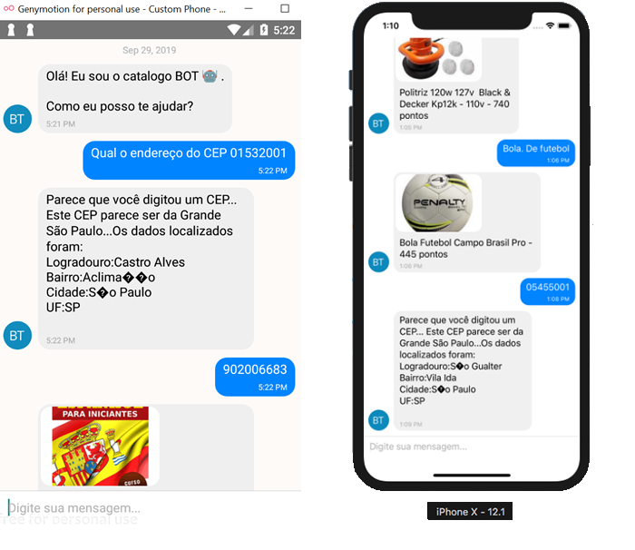

# BOT Catálogo de Premios

Este aplicativo feito em React Native faz a comunicação com um chatBot que utiliza a API do DialogFlow.

Ela pesquisa por produtos e categorias. Também tem a opção de retornar dados do CEP.

Existe uma API feita em NodeJS com Express que está integrada com o DialogFlow. Desta forma, de acordo com o que a API do DialogFlow identifica, ela faz a consulta para retornar as informações dos produtos e do CEP.

O link para este backend (Webhook de Fullfilment) pode ser visto neste link

https://github.com/dbins/bot_catalogo.git

## Instalação

- git clone https://github.com/dbins/bot_catalogo_aplicativo.git
- npm install
- Edite o arquivo /ReactotronConfig.js e informe o seu IP local. Essa etapa é opcional, é apenas para quem for testar a aplicação usando o Reactotron.
- Abra o emulador. Os testes foram feitos no Windows 10 utilizando o emulador Genymotion (Android) e no MacOS X High Sierra utilizando o XCode.
- react-native run-android ou react-native run-ios

## Gerar APK (Android)

Para gerar o APK de testes, a partir do terminal, dentro da pasta do projeto, faça o seguinte:

- cd android
- gradlew assembleDebug

## Recursos que foram utilizados:

* React Native Dialogflow
* React Native Gifted Chat
* React Native Video
* React Native Voice
* ReactoTron
* ESlint
* Prettier

